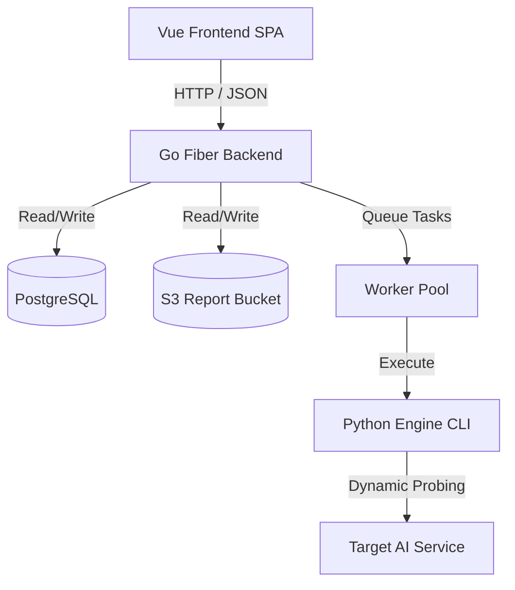

# Arishem

<p align="center">
  
</p>

Arishem is a security testing platform designed to discover prompt injection, jailbreaks, data leakage, and boundary failures in LLM-based applications, agentic workflows, and APIs.

The project is organized as a multi-tier system:
1. **Python Engine (`arishem/`)**: Core CLI and test runner that parses target function signatures via AST, executes multi-turn adversarial red-teaming loops, and judges responses using schema-constrained models.
2. **Go Backend Server (`backend/`)**: A Fiber API server handling user authentication via Clerk, database storage (PostgreSQL), task scheduling, and background worker queues.
3. **Vue Frontend (`frontend/`)**: A Vite + TypeScript SPA dashboard providing real-time run logs, reports downloading, alerts configuration, and public documentation.

---

## 🏗 System Architecture



### 1. Concurrency & Queue Worker Pool
To prevent system resource exhaustion, the Go backend manages background tasks through a concurrent queue worker pool:
* **Global Concurrency**: A maximum of **4 concurrent workers** run globally across the host system.
* **Per-Organization Limits**: Each user organization is restricted to **2 concurrent active runs**. Additional scans are re-queued to maintain fair resource availability.
* **Daily Rate Limiting**: The system enforces a daily limit on runs per organization, controlled by the `MAX_RUNS_PER_DAY` environment variable (defaults to 10). If the limit is exceeded, run creation requests are rejected with a `429 Too Many Requests` status.
* **Context-Based Cancellation**: Scans and LLM pentests can be aborted at any time. When cancelled, the backend terminates the underlying shell process instantly and cleans up the test container environment.

### 2. Isolated Container Sandboxing
Adversarial test scripts can be executed inside containerized environments to prevent arbitrary code execution on the host:
* When Docker mode is enabled, the backend spawns a sandboxed `python:3.11-slim` container.
* **Unprivileged Non-Root Execution**: Containers execute using the dynamically-detected UID and GID of the host's backend process (`--user uid:gid`). This restricts filesystem permissions and blocks privilege escalations.
* **Write Isolation**: A writable Python user-base base-path (`/tmp/arishem/user-base`) is mounted dynamically so that dependencies (`requirements.txt`) are installed via `pip install --user` without needing root write privileges inside the container.
* **Forced Containerization**: Setting the environment variable `EXPECTS_UNSAFE_CODE=true` forces all job executions (both static code scans and LLM pentests) to run inside Docker containers, overriding user selections.

---

## 🛡️ Supported Attack Classes

Arishem includes 9 built-in attack classes designed to red-team AI targets:
* **Goal Hijacking (`goal_hijacking`)**: Attempts jailbreaks, roleplay, suffix injection, or instruction overrides.
* **Cascading Failure (`cascading_failure`)**: Probes for infinite loops, memory leaks, or unhandled exceptions.
* **Context Poisoning (`context_poisoning`)**: Attempts context-window payload injection or history poisoning.
* **Insecure Delegation (`insecure_delegation`)**: Tests identity spoofing and unauthorized message delegation.
* **Persistent Drift (`persistent_drift`)**: Attempts behavioural deviation over multi-turn interactions.
* **Privilege Abuse (`privilege_abuse`)**: Evaluates administrative privilege boundary escalation.
* **Tool Misuse (`tool_misuse`)**: Evaluates argument injection and dangerous tool chaining.
* **Trust Exploitation (`trust_exploitation`)**: Probes for vulnerability to social engineering or authority spoofing.
* **Unsafe Execution (`unsafe_execution`)**: Attempts shell code execution or sandbox escape.

---

## 🚀 Getting Started

### Prerequisites
* **Python**: `python3.10` or higher
* **Go**: `go1.20` or higher (for the API backend)
* **Docker**: Required if running tests in containerized sandbox mode
* **PostgreSQL & Redis**: Backend database and queue broker dependencies

### Host Installation
Clone the repository and install the Python CLI package locally:
```bash
pip install -e .
```

---

## 💻 CLI Usage

### Register Target Functions
Targets must expose python functions prefixed with `arishem_` (e.g. `arishem_chat(prompt: str) -> str`).

*💡 **Tip**: You can use function docstrings to pass custom testing instructions or specification details directly to the red-teaming LLM generator. Arishem statically extracts these docstrings and injects them into the attack prompts to formulate more targeted test payloads.*

### Run Pentest directly via CLI
```bash
python3 -m arishem.cli run target_example.py --output results.json
```

### Convert JSON results to HTML or SARIF
```bash
python3 -m arishem.cli report results.json --format html --output report.html
```

---

## 🌐 Full-Stack Deployment (Docker Compose)

Deploy the entire stack (PostgreSQL, Redis, MinIO S3, Go Backend) using the root configuration:

1. **Setup Env Variables**:
   Copy `.env.example` to `.env` and fill in your values (including Clerk auth keys):
   ```bash
   cp .env.example .env
   ```

2. **Start Services**:
   ```bash
   docker compose up --build -d
   ```

3. **Frontend SPA compilation**:
   Compile Vite assets and deploy to static hosting (Netlify, Vercel, or Cloudflare Pages):
   ```bash
   cd frontend
   npm install
   npm run build
   ```
